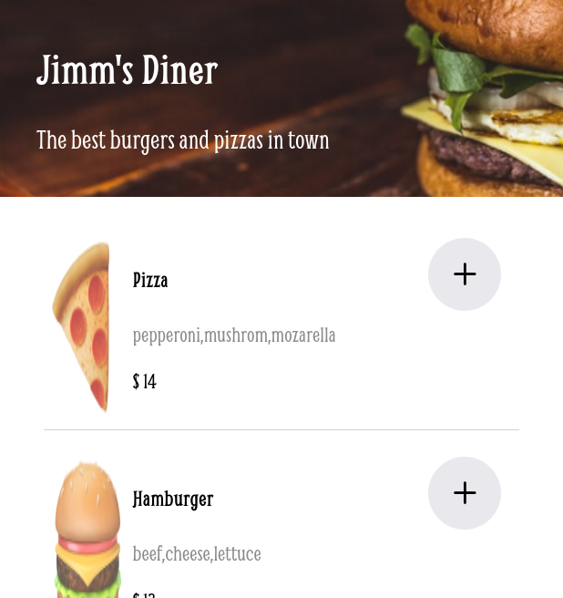

## Restaurant ordering application
## Table of contents

- [Overview](#overview)
  - [The challenge](#the-challenge)
  - [Screenshot](#screenshot)
  - [Links](#links)
- [My process](#my-process)
  - [Built with](#built-with)
  - [What I learned](#what-i-learned)
- [Acknowledgments](#acknowledgments)

## Overview

### The challenge

Users should be able to:

- Choose menu items
- See menu items
- Pay for menu items

### Screenshot

### Links

- Live Site URL: [restaurant url](https://restaurant-ordering-r6yn0aipi-clinton-dev.vercel.app/)

## My process

### Built with

- Semantic HTML5 markup
- CSS custom properties
- Mobile-first workflow
- Vanilla javascript
- [fontawesome](https://cdnjs.com/libraries/font-awesome) - Fontawesome icons

### What I learned
- Implementing Dry principles, when ever I found myself repeating the same code I choose to write a function which I can call thus making the code modular
- Proper naming of variable names such as using prefix is for a boolean kind of variable

## Acknowledgments

- All this wouldn't have been possible if it were not from the knowledge passed from tutors at [scrimba](https://www.google.com/url?sa=t&rct=j&q=&esrc=s&source=web&cd=&cad=rja&uact=8&ved=2ahUKEwiR-eK3n8z6AhVRsaQKHcIfClUQFnoECBYQAQ&url=https%3A%2F%2Fscrimba.com%2Fabout&usg=AOvVaw1LGuR5RjRSUYOF1gxZtpwO)

